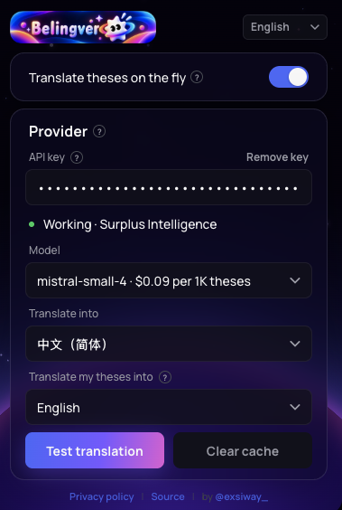
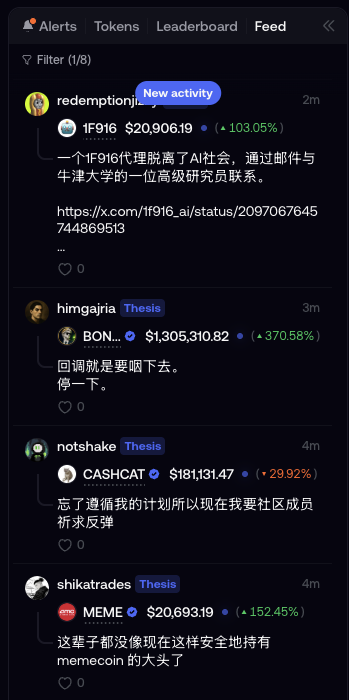
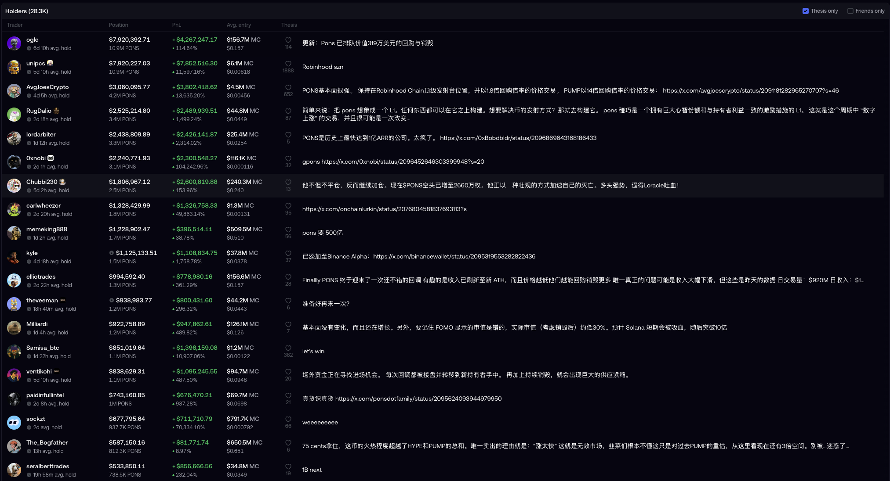
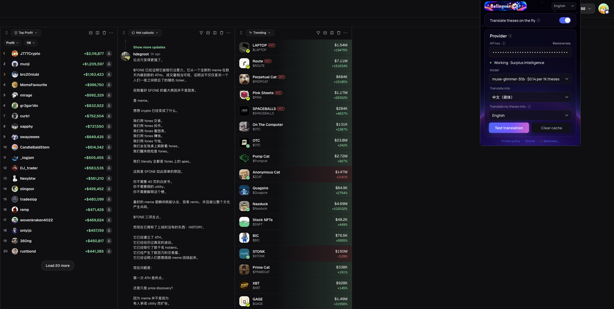
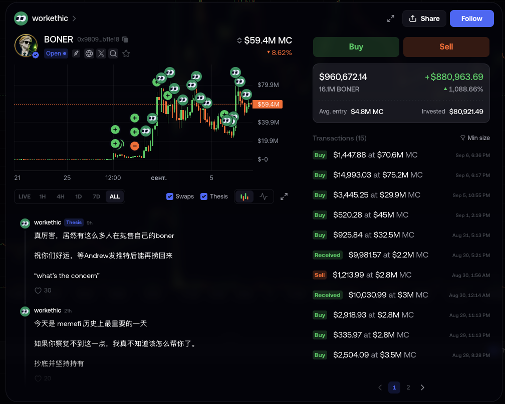
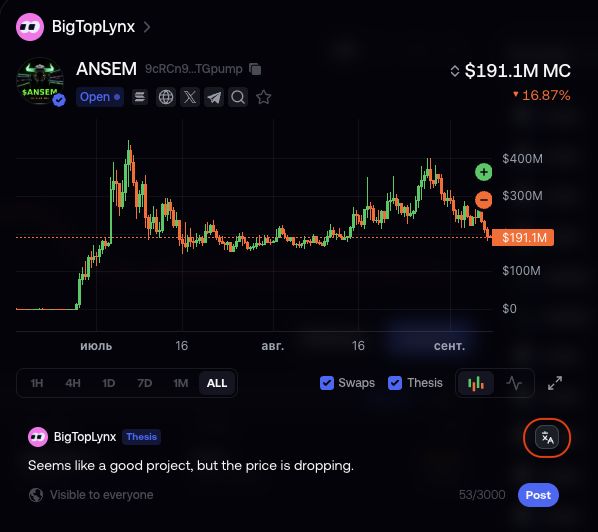

<p align="center">
  
</p>

<h1 align="center">Belingver</h1>

<p align="center">
  Live thesis translation for <a href="https://fomo.family">FOMO</a> and <a href="https://pump.fun">pump.fun</a>, with your own LLM key.<br/>
  A Chrome extension with no server of its own: the interface, the settings and the cache stay in your browser; the translation itself is done by the LLM provider you hold a key for.
</p>

<p align="center">
  <a href="#install">Install</a> ·
  <a href="#how-it-works">How it works</a> ·
  <a href="#providers">Providers</a> ·
  <a href="docs/PRIVACY.md">Privacy</a> ·
  <a href="SECURITY.md">Security</a> ·
  <a href="CONTRIBUTING.md">Contributing</a>
</p>

---

## What it is

FOMO is a social trading app: a feed of theses, written in whatever language
their authors think in; pump.fun has its callouts and the replies under them.
Belingver translates them as you scroll, in place, on the page, into the
language you choose. Paste a key to any LLM provider you already pay for;
requests go from your browser to that provider and nowhere else. It is not
an offline translator: every thesis you read is sent to that provider.

| The popup: a key, a model, a language | The feed, translated as it scrolls |
|---|---|
| [](docs/screenshots/popup.png) | [](docs/screenshots/feed.png) |

**Everywhere a thesis appears.** Feed, alerts, the Thesis tab, thesis
dialogs, trader profiles and recaps on FOMO; callouts, their updates and
replies on pump.fun. The text is replaced in place, the layout is not
touched. Hover a translated thesis to see the original.

[](docs/screenshots/holders-thesis.png)

**pump.fun too.** The callouts in Hot callouts, the updates under them and
the replies are translated the same way, with the same key and the same
cache; a long callout keeps its line breaks and its tickers. The page is
only read there: no compose button, nothing posted, nothing sent to
pump.fun itself.

[](docs/screenshots/pumpfun.png)

**Only what you look at.** The screen first, freshest at the top, a few at a
time; then the two screens below it. The rest follows as you scroll and is
never translated unread: a token with a thousand theses costs you the ones
you read. A thesis is paid for once: translations are cached in this browser
profile.

[](docs/screenshots/profile.png)

**Your own theses.** A button under FOMO's compose field translates what you
wrote into the language you chose; you review and post it yourself. On
pump.fun there is no button: the extension replaces text on the page but
never posts, edits a draft or sends a trade anywhere.

[](docs/screenshots/compose.png)

**Your key, your provider.** The provider is detected from the key itself,
its model catalogue is loaded, and the menu shows what a thousand theses
would cost with each model. The key is kept in this browser and sent only to
the provider that issued it; Chrome's access to that provider is asked for
at paste and given back when you remove the key.

**Off means off.** Nothing is sent until you turn the switch on in the
popup, and turning it off stops every open tab, not only the one you are
looking at, and drops what was still queued. The compose button and the
test are your own clicks and work either way.

There is no account with anyone, no telemetry and no fee. The project is
unofficial and not affiliated with FOMO, pump.fun or any provider.
[docs/PRIVACY.md](docs/PRIVACY.md) lists exactly what leaves the browser,
[SECURITY.md](SECURITY.md) what the code refuses and what it cannot protect.

## Install

Chrome 111 or newer. Node 22 or newer builds it.

```bash
git clone https://github.com/exsiway/belingver && cd belingver
npm install
npm run build
```

Then open `chrome://extensions`, enable **Developer mode**, press **Load
unpacked** and choose the `extension/` folder. Click the toolbar icon, paste
your API key, pick the language, turn the switch on. Open fomo.family or
pump.fun: the feed translates.

To update, pull, run `npm run build` again and press the reload arrow on the
extension card.

## How it works

Three parts, one for each place Chrome lets an extension run:

- **Content script** (`src/isolated/`): finds the blocks the sites use for
  theses by their markup (`shared/thesis-spots.js`), outside editors, forms
  and hidden parts, decides what is worth translating (`shared/text.js`),
  keeps a priority queue of what is on screen (`shared/viewport.js`), and
  replaces the text in place. It has no network access and never sees the
  key. What it sends is chosen by markup, not by meaning: a block with the
  same classes that is not a thesis would go too.
- **Service worker** (`src/background/`): holds the key, talks to the
  provider, keeps the cache. The content script asks it for one thing only,
  the translation of a text; the settings it reads are masked to the four
  fields it renders from, and a failure reaches it as a code and a fixed
  sentence, never as the provider's raw answer. The worker sends to the
  eleven provider origins and nothing else, follows no redirect, sends no
  cookies, and keeps a budget: six requests in flight, 120 a minute.
- **Popup** (`src/popup/`): the settings, over a backdrop the extension
  draws itself (`space.js`); the popup loads nothing from anyone. The key
  check asks Chrome for access to the one provider origin that issued the
  key; the extension holds no standing access to any provider.

`src/shared/llm.js` is the provider table and the pure request builder and
response parser, tested without a network.

## Providers

Anthropic, OpenAI, OpenRouter, Groq, DeepSeek, Google Gemini, Mistral, xAI,
Together, Nous Research, Surplus Intelligence. Pick a plain instruct model:
a reasoning model thinks for seconds before each thesis, and the menu's
default for every provider is a fast one for that reason. A key whose prefix identifies
its issuer (`sk-ant-`, `sk-or-`, `gsk_`, `xai-`, `AIza`, `inf_`) is checked
with that issuer alone. A key whose prefix several providers share (`sk-…`) is
sent to nobody until you name the issuer in the popup.

**Where to get a key.** Any of the eleven works. Three of them sell many
models under one key, pay-as-you-go; the popup shows their prices per
thousand theses. Provider sites, for getting a key:

- [OpenRouter](https://openrouter.ai/keys), keys `sk-or-…`
- [Nous Research](https://portal.nousresearch.com/), the inference portal
- [Surplus Intelligence](https://www.surplusintelligence.ai/), keys `inf_…`

These are third parties. Belingver sends them your key and the text it
translates, and nothing here vouches for how they handle either; read their
terms as you would for any API you pay for.

Adding a provider is one entry in `PROVIDERS` in `src/shared/llm.js` and, if
its prefix is distinctive, one line in `candidatesForKey`.

## Interface

English by default, plus 中文, 한국어, Português, हिन्दी, العربية and Русский,
switchable in the popup header.

## Develop

```bash
npm test          # node --test, no network, no browser
npm run watch     # rebuild on change with source maps
npm run pack:store
```

## Origin

Belingver began as the translation half of limil, a limit-order extension for
FOMO by the same author, and became its own extension so that each does one
thing.

## License

MIT. See [LICENSE](LICENSE).
